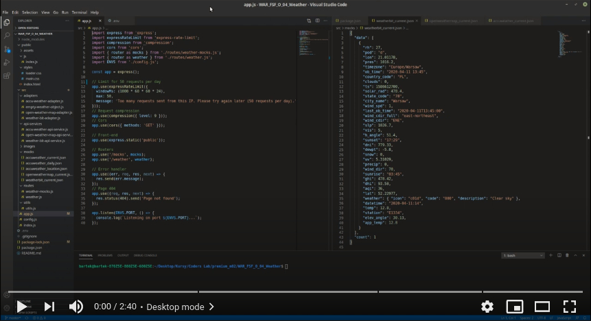

# Weather comparison (Workshop-3, Node.js)

A responsive app that allows you to compare current weather conditions for a given location from 3 various APIs. The project is the part of the Coders Lab course.


# Live demo
https://weather-comparison-workshop-3.herokuapp.com/

# Video demo
[](https://youtu.be/I93otWvwb50)

# Features
## Back-end
* Limit of the number of requests to endpoints (see the 'Information' section).
* Compression of response bodies.
## Front-end
* Responsive Web Design (RWD) modes:
  * mobile (< 768px)
  * desktop (>= 768px)
* Animated circular progress indicator.
## Mocks mode
* When active, the app uses hardcoded weather data from JSON files instead of requesting APIs.
* Toggle the mocks mode with a variable (see the 'ENV file' section).
# Information
* Weather data API providers:
  * WeatherBit: https://www.weatherbit.io/
  * OpenWeather: https://openweathermap.org/
  * AccuWeather: https://developer.accuweather.com/
* The app has the limit of **50 requests per day**.
* WeatherBit does not provide minimum and maximum temperature values (*n/a* on the screen).
* Front-end was bootstrapped with files provided by Coders Lab.
* Hardcoded weather data as JSON files are stored in `./mocks` (see the 'Mocks mode' section).
* The project was customized to [Create React App](https://github.com/facebook/create-react-app) bootstrap configuration. It was used to build the production version of the project for deploying the live demo.
## ENV file
* This file was not included into the project (contains confidential API keys).
* To receive your own API keys, you need to sign up in every weather data API provider and choose limited/trial service package.
* Then, create an .env file in `./src` with the following content:
```
PORT=3000                                       // server port number

OPEN_WEATHER_MAP_MOCK=true                      // true/false - toggles the mock mode
OPEN_WEATHER_MAP_ICON_BASE_URL=http://openweathermap.org/img/wn
OPEN_WEATHER_MAP_API_BASE_URL=http://api.openweathermap.org/data/2.5
OPEN_WEATHER_MAP_API_KEY={your-api-key}         // provide your private API key


WEATHER_BIT_MOCK=true                           // true/false - toggles the mock mode
WEATHER_BIT_ICON_BASE_URL=https://weatherbit.io/static/img/icons
WEATHER_BIT_API_BASE_URL=https://api.weatherbit.io/v2.0
WEATHER_BIT_API_KEY={your-api-key}              // provide your private API key

ACCU_WEATHER_MOCK=true                          // true/false - toggles the mock mode
ACCU_WEATHER_ICON_BASE_URL=http://developer.accuweather.com/sites/default/files
ACCU_WEATHER_API_BASE_URL=http://dataservice.accuweather.com
ACCU_WEATHER_API_KEY={your-api-key}             // provide your private API key
```

# Technologies
* Express
* Node-Fetch
* JS (ES6)
* CSS, RWD
* HTML
* Fonts:
  * Varela Round

# Download and Install
* Use the link from the 'Code' button to download the project.
* In the project main directory, type:
```
npm i
```

to install necessary dependencies.
* **Create an .env file to ensure the app proper execution** (see the 'ENV file' section for details).
* Run:
```
npm run start
```
to start the app.
* Open http://localhost:3000 to view it in the browser.